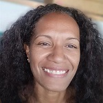

Étudiante en 3ème année de BUT Infonum

📧 Email: gos.mn21@gmail.com
📞 Téléphone: demande par email
🌐 Portfolio: demande par email
📍 Adresse: 33 300 Bordeaux

À propos de moi

En formation continue avec une solide expérience dans le milieu de la documentation et de l'enseignement. Méthodique, patiente et persévérente, je mène à terme ce que j'entreprends, toujours avec dynamisme et enthousiasme.

***Formation***

    En 2ème année MEEF parcours Documentation
    Bachelor Infocom parcours Informations numériues
    Bac série Littéraire spé. anglais

***Expériences professionnelles***
***Stage - Professeure Documentaliste***
    Collège Pablo Néruda
    Lycée les Iris
    Collège Cassignol

    Gestion des ressources documentaires : Participation à l’acquisition, au classement et à la mise à jour des ressources du CDI, sous la supervision de la professeure documentaliste titulaire.
    Valorisation des fonds documentaires : Contribution à la mise en avant des ressources (affichages, présentoirs, outils numériques) pour les rendre accessibles aux élèves et à la communauté éducative.
    Formation des élèves : Animation d’ateliers d’initiation à la recherche d’information et à l’éducation aux médias, en collaboration avec l’équipe pédagogique.
    Collaboration pédagogique : Participation à la conception de projets interdisciplinaires intégrant les compétences infodocumentaires, avec l’appui des enseignants.
    Animation culturelle : Organisation d’activités autour de la lecture et de la culture (clubs lecture, expositions thématiques) en lien avec les besoins des élèves.
    Veille documentaire : Participation à la veille informationnelle pour enrichir les ressources du CDI, avec un focus sur les outils numériques et les besoins disciplinaires.
    Accompagnement des élèves : Aide individualisée aux élèves pour leurs recherches et leurs travaux scolaires, en développant des outils d’autonomie.
    Développement de partenariats : Contribution à l’établissement de liens avec des acteurs culturels locaux (bibliothèques, musées) pour enrichir l’offre du CDI.
    Promotion de la lecture : Mise en place d’actions pour encourager la lecture plaisir et l’ouverture culturelle (sélections thématiques, défis lecture).
O    rganisation d’événements : Assistance à l’organisation d’événements au CDI (rencontres avec des auteurs, expositions, etc.), en collaboration avec l’équipe éducative.

**Stage - Documentatliste**
Département de la Gironde, 
Direction de la Documentation, Bordeaux - Mai 2023 à Juillet 2023

    Gestion et mise en valeur d'un fonds spécifique.
    Collaboration avec l’équipe pour l'indexation et la mise en valeur du fonds.
    Voir une réalisation.

**Aide documentatliste**

Médiathèque pédagogique des Enseignants , Nouvelle-Calédonie - Janvier 2019 à Août 2022

    Gestion courate du fonds quotidien ete du service.
    Gestion et mise en valeur d'un fonds spécifique.
    Assistance au sein du pôle "Ressources documentaires".
    Voir une réalisation

***Compétences***

***Logiciels et outils numériques :***

    Maîtrise des outils documentaires (BCDI,PMB,Esidoc) et initiation à KOHA
    Utilisation de Zettlr et Zotero pour la gestion des références bibliographiques et la veille documentaire.
    Connaissance basique de GitHub pour le partage et la collaboration sur des projets documentaires.
    Création de supports visuels avec Canva (mémoire, posters, carnets de voyage).
    Utilisation d’UPtale pour la création de vidéos 360° immersives.
    Expérience avec les outils de cartographie (cartoparty, cartographie des controverses).
    Prise en main d’outils audio (Webradio, cartes sonores, micro-trottoir).
    Initiation aux outils des Fablabs (impression 3D, découpe laser, etc.).

***Communication et médiation :***

    Excellentes compétences rédactionnelles (création de supports pédagogiques, fiches méthodologiques, nouvelles).
    Aisance à l’oral pour animer des ateliers (ludopédagogie, ateliers d’écriture, Webradio).
    Contribution à des projets collaboratifs (Wikipédia, cartoparty).
    Capacité à adapter son discours selon les publics (élèves, enseignants, partenaires).

***Gestion de projet et pédagogie:***

    Capacité à participer à la gestion de plusieurs projets simultanément (expositions, clubs lecture, ateliers EMI).
    Expérience en ludopédagogie et en animation d’ateliers créatifs (écriture de nouvelles, carnet de voyage).
    Participation à des projets innovants (IA et documentation, cartes sonores, vidéos 360°).
    Travail en équipe avec les enseignants, partenaires culturels et acteurs des Fablabs.
    Polyvalence pour s’adapter aux besoins du CDI et aux imprévus.

***Langues***

    Français: Langue maternelle
    Anglais: Courant

***Centres d’intérêt***

    Pratique et préside un club d'aïkido
    

Pour plus d’informations ou pour consulter mes réalisations, n’hésitez pas à visiter mon portfolio en ligne.
